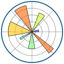

<h1 align="center">Hey, I'm Jonathan 👋</h1>

  <b><em>Honours Computer Science @ McMaster University &nbsp;·&nbsp; Minor in Statistics</em> </b>
  <em>Software Engineering &nbsp;·&nbsp; Machine Learning &nbsp;·&nbsp; Data-Driven Systems &nbsp;·&nbsp; Cloud Technologies &nbsp;·&nbsp; Full-Stack Development</em>

---

  

---

## 💡 About Me

**Welcome to my GitHub profile!** I'm an **aspiring software developer** with a passion for building projects that combine backend logic and front-end design with databases featuring real-world data. I'm always eager to exploring and gaining hands-on experience on new languages, frameworks, and technologies.

---

## 🌟 Let's Connect!

I'm always open to learning, collaborating, and developing meaningful solutions to challenging problems. I'm currently seeking **internship opportunities** in environments that emphasize learning, collaboration, and impact. 🙌

Feel free to reach out! 

---

## 📊 GitHub Stats

  

---

## 🛠️ Technologies & Tools

### Languages

  
  
  
  
  
  
  
  
  

### Databases & Storage

  
  
  
  

### Frameworks & Libraries

  
  
  
  
  
  
  
  
  
  

### Cloud, DevOps & Tools

  
  
  
  
  
  
  

---
 

  

